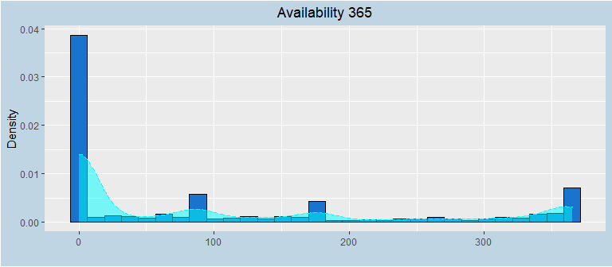
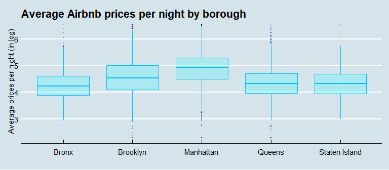

Data visualization corresponds to the graphic representation of data, whose goal is to communicate essential information clearly and effectively to users/customers. It becomes one of the core skills in data science. Indeed seeing graph allows us to integrate information quickly, and makes the data more meaningful. In consulting, marketing, finance and more generally in data science, being able to manage this task is highly recommended. Moreover in the development of a ML project, the data visualization part take also an important place: if the different algorithms will allow you to obtain the results, the data visualization that comes before will give you a first approach, making complex data more understandable before you can move on to building a model. In this document, you will see through a set of example an overview of the data visualization in a ML project. To do this, we will use the same dataset as before ( _NYC Airbnb_ ). 

Many tools are available to do data visualization, but performing this task in R is mostly done using the `ggplot2` package (see *[here](https://juba.github.io/tidyverse/08-ggplot2.html)* if you want to learn more about `ggplot2`). 


# Univariate analysis

## Frequence of categorical variables

The first analysis we can make is to look at the distribution of our variables. Thus we can start by having a look on the distribution of our categorical ones. We can then rely on pie chart (`coord_polar`) or bar chart (`geom_bar`). Since we have several factorial variables and we want to see the distribution of each of them, using a *for loop* is very useful.

In order to have the same structure for each graphic in this project, we configure here the argument `theme` of the function `ggplot`. Another option would be to use the `ggthemes` package that gives access to a set of several already configured themes.


```r
theme <- theme(plot.title = element_text(hjust = 0.5),
               plot.background = element_rect(fill = "#BFD5E3"))
```


```r
names <- names(data)

data <- data %>% rename(borough = neighbourhood_group_cleansed)
data <- data %>% rename(neighbourhood = neighbourhood_cleansed)

features_categorical <- names(select_if(data[,-c(1,5)],is.factor))
# Without id, neighbourhood_group_cleansed

for (i in features_categorical) {
  plot <-ggplot(mapping = aes_string(x = fct_infreq(data[,i]))) +
    geom_bar(fill="skyblue", width = 1, colour = "white", show.legend = F,
             aes(y = ((..count..)/sum(..count..)))) +
    geom_text(aes(y = ((..count..)/sum(..count..)),
                  label = scales::percent((..count..)/sum(..count..))),
              stat = "count", size=4, vjust = -.3) +
    scale_y_continuous(labels = scales::percent) +
    theme + labs(x = "", y = "") + 
    ggtitle(str_replace_all(str_to_title(i), c("_" = " ")))
  print(plot)
}
```


Thus we can see that most of the housing offers are apartment in Manhattan and Brooklyn with a strict cancellation policy. We also can go further and combine the different variables.


## Density and log of numeric variables

Now we can have a look on the continuous variables. A good way to deal with these ones is to rely on histogram (`geom_histogram`) and density function (`geom_density`). In addition we can plot for each of them their logarithmic distribution, and then see if some of them should be transformed in log in our future models.


```r
# Continuous 
features_continuous <- c("price", "cleaning_fee", "review_scores_rating")

for (i in features_continuous){

  plot <- ggplot(mapping = aes(x = data[,i])) +
    geom_histogram(colour="black", fill="dodgerblue3",
                   aes(y = ..density..)) + theme + 
    ggtitle(str_replace_all(str_to_title(i), c("_" = " "))) +
    labs(x = "", y = "Density") +
    geom_density(fill = "cyan", colour = "cyan",
                 alpha = 0.5, lwd=0.5, linetype = "dashed")

  log_plot <- ggplot(mapping = aes(x = log(data[,i]))) +
    geom_histogram(colour="black", fill="forestgreen",
                   aes(y= ..density..)) + theme +
    labs(x = "", y = "Density") +
    ggtitle(str_replace_all(paste("Log of",str_to_title(i)), 
                            c("_" = " "))) +
    geom_density(fill = "olivedrab2", colour = "olivedrab2",
                 alpha = 0.5, lwd=0.5, linetype = "dashed")

  grid.arrange(plot, log_plot, ncol=2)
}
```


```r
# discrete
features_discrete <- c("beds", "bedrooms", "accommodates", "minimum_nights",
                       "availability_365")

for (i in features_discrete){

  plot <- ggplot(mapping = aes(x = data[,i])) +
    geom_histogram(colour="black", fill="dodgerblue3",
                   aes(y = ..density..)) + theme + 
    ggtitle(str_replace_all(str_to_title(i), c("_" = " "))) +
    labs(x = "", y = "Density") +
    geom_density(fill = "cyan", colour = "cyan",
                 alpha = 0.5, lwd=0.5, linetype = "dashed")
  print(plot)
}
```


We can see for example that the distribution of the average price per night has a distribution similar to a Gaussian after logarithmic transformation, while the latter was biased to the left before. We will therefore keep this transformation for our prediction work. By doing so it will allow us to estimate the semi-elasticity of the price respectively to the explanatory variables. By using the same reasoning, the *Cleaning fee* could also be transformed (in fact it mainly concern the continuous variables). 

> Warning:
> Since *Cleaning fee* has a lot of 0 values, the grahp which represent its
> log-transformation does only consider the positive values. If we want to compute 
> the log-transformation of *Cleaning fee*, an alternative would be to add a positive 
> constant to each value before (for example 1) and then take a log-transformation.


```r
data$price <- log(data$price)
```


Then if we look at the distribution of *accommodates*, *beds* and *bedroom* for example, we see that there are some outliers that biased the distribution. When facing this situation, the question we should ask ourselves is *what to do with these observations?*. Since the decision of keeping them, replacing them or removing them can drastically change the fit estimates and predictions, it is essential to understand their presence in our data and their potential impact on our predictive models. 

## Remove outliers

The decision rule to apply depends on the situation we face. For example a rule that one could apply here would be to keep only the observations where the price is less or equal to a fixed threshold: 

- **1st method** :  Most of the time when the distribution is Gaussian, a common rule is to use the Interquartile Range (here the upper limit of the log of the price):

                    3rd quartile (log(price)) + 1,5 * IQR (log(price)) 


```r
Q <- quantile(data$price, probs=c(.25, .75))

# Here Q[2] corresponds to the 3rd quartile of the price distribution
out <- Q[2] + 1.5 * IQR(data$price)
data <- data %>% filter (price <= out)
```


Other methods (multivariate data case) : 

- **Local Outlier Factor** : based on *k-nn*, it measures the local deviation of a given data point with respect to its neighbors. The aim is therefore to compare the local density of an observation to the local densities of its neighbors, and the ones that have a lower density than their neighbors are considered as outliers.

- **Isolation Forest** : The outliers are detected using the anomaly score of an isolation forest. It isolates the outliers by randomly selecting a feature from the given set of features and then randomly selecting a split value between the max and min values of that feature. The default threshold of 0.025 will classify as outliers the observations located at qnorm(1-0.025) * MAD (median absolute deviation), which corresponds to the 2.5% most extreme observations.

Now let's see one more time the distribution of our numeric variables and see if the specific treatment for *price* has changed something. 


```r
for (i in features_discrete){
  plot <- ggplot(mapping = aes(x = data[,i])) +
    geom_histogram(colour="black", fill="dodgerblue3",
                   aes(y = ..density..)) + theme + 
    ggtitle(str_replace_all(str_to_title(i), c("_" = " "))) +
    labs(x = "", y = "Density") +
    geom_density(fill = "cyan", colour = "cyan",
                 alpha = 0.5, lwd=0.5, linetype = "dashed")
  print(plot) 
}
```


The distribution of *accommodates*, *bedrooms*, *beds* and *minimum_nights* presents some outliers that we will remove. 


```r
outlier <- c("bedrooms", "beds", "accommodates", "minimum_nights")
df_out <- data[,outlier]
summary(df_out)
```

```
##     bedrooms           beds         accommodates    minimum_nights    
##  Min.   : 0.000   Min.   : 0.000   Min.   : 1.000   Min.   :   1.000  
##  1st Qu.: 1.000   1st Qu.: 1.000   1st Qu.: 2.000   1st Qu.:   2.000  
##  Median : 1.000   Median : 1.000   Median : 2.000   Median :   3.000  
##  Mean   : 1.167   Mean   : 1.495   Mean   : 2.822   Mean   :   7.879  
##  3rd Qu.: 1.000   3rd Qu.: 2.000   3rd Qu.: 4.000   3rd Qu.:   5.000  
##  Max.   :21.000   Max.   :16.000   Max.   :16.000   Max.   :1250.000
```

For both *beds*, the IQR is equal to 0. Thus we will not be able to apply the same rule as before, since it will eliminate all the observations that are greater than the third quartile. However, since we know the distribution of our data, an alternative would be to set a level from which an observation will be considered as an outlier. Therefore we will keep only the observations with at most 5 bedrooms, 7 beds, an accommodation of 10, and finally the observations with a minimum nights that cannot exceed two weeks (we won't take into account the long term rental).

We will therefore set a threshold for each variable by observing their distribution. For example, housing with more than five beds are marginal, so we will remove them.


```r
data <- data[data$bedrooms <= 5 & data$beds <= 7 & data$accommodates <= 10
             & data$minimum_nights <= 14,]
```

So now this are the new distribution of our discrete features:


```r
for (i in features_discrete){
  plot <- ggplot(mapping = aes(x = data[,i])) +
    geom_histogram(colour="black", fill="dodgerblue3",
                   aes(y = ..density..)) + theme + 
    ggtitle(str_replace_all(str_to_title(i), c("_" = " "))) +
    labs(x = "", y = "Density") +
    geom_density(fill = "cyan", colour = "cyan",
                 alpha = 0.5, lwd=0.5, linetype = "dashed")
  print(plot) 
}
```



Finally, we will create some categories for *accommodates*, *bedrooms* and *beds*:


```r
# Accommodates
data <- data %>% 
  mutate(accommodates =  ifelse(accommodates >= 5, "5_more", accommodates))

# Bedrooms
data <- mutate(data,
               bedrooms =  ifelse(bedrooms >= 3, "3_more", bedrooms))

# Beds
data <- mutate(data,
               beds =  ifelse(beds >= 3, "3_more", beds))

# We then convert them into factor
fac_feature <- c("accommodates", "bedrooms", "beds")

for (i in fac_feature){
  data[,i] <- as.factor(data[,i])
}
```

And then we get:


```r
for (i in fac_feature){
  plot <-ggplot(mapping = aes_string(x = data[,i])) +
    geom_bar(width = 1, fill="skyblue", colour = "white", show.legend = F,
             aes(y = ((..count..)/sum(..count..)))) +
    geom_text(aes(y = ((..count..)/sum(..count..)),
                  label = scales::percent((..count..)/sum(..count..))),
              stat = "count", size=4, vjust = -.3) +
    scale_y_continuous(labels = scales::percent) +
    theme + labs(x = "", y = "") + 
    ggtitle(str_replace_all(str_to_title(i), c("_" = " ")))
  print(plot)
}
```


# Bivariate analysis

## Housing distribution by borough

Here is a complete example of what you can do with `gg plot`:


```r
# Housing type by borough

ggplot(data, aes(x = borough, 
                 group = property_type)) +
  geom_bar(aes(y = ..prop.., 
               fill = factor(..x.., labels = c('Bronx','Brooklyn','Manhattan',
                              "Queens","Staten Island"))), stat="count") +
  geom_text(aes(label = scales::percent((..prop..), accuracy = 3L),
                y= ..prop.. ), stat= "count", vjust = -.4, size=2) +
  facet_grid(~property_type) +
  scale_y_continuous(labels = scales::percent) +
  ggtitle("Distribution of housing type by borough") + 
  theme(plot.title = element_text(hjust = 0.5),
        plot.background = element_rect(fill = "#BFD5E3"),
        axis.text.x=element_blank(), axis.ticks.x=element_blank()) +
  labs(x = "", y = "", fill = "Borough") +
  scale_color_discrete()
```


```r
# Housing distribution by property type in each borough

ggplot(data, aes(x = property_type, 
                 group = borough)) +
  geom_bar(aes(y = ..prop.., 
               fill = factor(..x.., labels = c('Appartment','House',
                                               'Private Room'))),
           stat="count") +
  geom_text(aes(label = scales::percent((..prop..), accuracy = 3L),
                y= ..prop.. ), 
            stat= "count", vjust = -.5, hjust = 0.3, size=2) +
  facet_grid(~borough) +
  scale_y_continuous(labels = scales::percent) +
  ggtitle("Distribution of housing by property type in each borough") + 
  theme(plot.title = element_text(hjust = 0.5),
        plot.background = element_rect(fill = "#BFD5E3"),
        axis.text.x=element_blank(), axis.ticks.x=element_blank()) +
  labs(x = "", y = "", fill = "Property type") +
  scale_color_discrete()
```


On the first graph, we can see that almost one half of the apartment offers are located in Manhattan (although it is the smallest borough), whereas regarding house rentals, 83\% of the offers are in Brooklyn ans the Queens. On the other hand the second graph show us that the apartments are the most common offer in each borough, except for Staten Island where we can find more house rental offers.


## Price by borough (using Boxplot)

Boxplot are commonly use in data viz and descriptive statistic in order to compare a same factor between several distinct populations. It is also a simple way of displaying a quantitative serie based on a five-number summary: the minimum, the maximum, the sample median, and the first & third quartiles.


```r
ggplot(data, aes(x = borough, y = price)) +
  geom_boxplot(outlier.colour = "darkblue", outlier.size = 0.5,
               color="deepskyblue", fill="cyan", alpha=0.2) +
  ggtitle("Average Airbnb prices per night by borough") +
  labs(x = "", y = "Average prices per night (in log)") + 
  theme_economist()
```



The higher prices are in Manhattan whereas the lower are in the Bronx. Looking at the sizes of the boxes, we can say that rental price disparity is more pronounced in Brooklyn than in the other borough. Moreover these boxplots give us an indication about the outliers which are represented by the little darkblue points.


## Price by Property type


```r
ggplot(data, aes(x = property_type, y = price)) +
  geom_boxplot(outlier.colour = "darkblue", outlier.size = 0.5,
               color="deepskyblue", fill="cyan", alpha=0.2) +
  ggtitle("Average Airbnb prices per night by property type") +
  labs(x = "", y = "Average prices per night (in log)") + 
  theme_economist()
```


## Price by borough and property type

One more time we can go further and compare the median price per night by property type between the different boroughs.  


```r
ggplot(data, aes(x = borough, y = price,
                 fill = property_type)) +
  geom_boxplot(outlier.colour = "darkblue", outlier.size = 0.5) +
  ggtitle("Average Airbnb prices per night by borough & property type") +
  scale_fill_discrete(name = "Property type") + 
  labs(x = "", y = "Average prices per night (in log)") +
  theme
```


# Spatial Heatmap

Until now, we have not used the information about latitude and longitude. However they can be very useful when it comes to represent your data through spatial heatmap. Here we will present you the basic map that you can create. If you want you can go further and use more sophisticated function such as `get_googlemap` or `get_map`, but this library will require an API key google map that you can obtain by registering with Google Cloud (warning: Usage and billing may apply).   


```r
# Define the basemap

borders <- c(bottom  = min(data$latitude),
             top     = max(data$latitude),
             left    = -74,
             right   = max(data$longitude))

map <- get_stamenmap(borders, zoom = 10, maptype = "terrain", crop = FALSE)
```

## Price by borough


```r
# We take the real price for the map
data$price <- exp(data$price)

by_borough <- data %>% group_by(borough) %>%
  summarize(longitude = median(longitude),
            latitude = median(latitude),
            prix_moyen = mean(price),
            prix_median = median(price),
            scores_moyen = mean(review_scores_rating),
            disponibilité_moyenne = mean(availability_365))

# # ===== ===== Average price by borough ===== =====
ggmap(map) +
  geom_point(by_borough, shape = 18,
             mapping = aes(x = longitude, y = latitude,
                           col = prix_moyen, size = disponibilité_moyenne)) +
  scale_colour_gradient(low = "blue", high = "red") +
  theme + labs(x = "", y = "", 
               size = "Annual availabilities",
               col = "Average price") +
  ggtitle("Average price and availabilities by borough") +
  geom_label(by_borough,
             mapping = aes(longitude, latitude,
                           label = borough),
             size = 1.5, fontface = "bold",
             nudge_x = 0.015, nudge_y = -0.03)
```


## Price by neighborough in Manhattan


```r
data_Manhattan <- data %>% filter(borough == "Manhattan")

bbox <- c(bottom  = min(data_Manhattan$latitude),
             top     = max(data_Manhattan$latitude),
             left    = min(data_Manhattan$longitude),
             right   = max(data_Manhattan$longitude))

map2 <- get_stamenmap(bbox, zoom = 14, maptype = "terrain", crop = FALSE)

by_neighbourhood <- data_Manhattan %>% group_by(neighbourhood) %>%
  summarize(longitude = median(longitude),
            latitude = median(latitude),
            prix_median = median(price),
            prix_moyen = mean(price),
            scores_moyen = mean(review_scores_rating))

# # ===== ===== Average price by neighbourhood ===== =====
ggmap(map2) +
  geom_point(by_neighbourhood, shape = 18,
             mapping = aes(x = longitude, y = latitude,
                           col = prix_moyen)) +
  scale_colour_gradient(low = "blue", high = "red") +
  theme(plot.title = element_text(hjust = 0.5), 
        plot.background = element_rect(fill = "#BFD5E3"),
        axis.text.x = element_text( angle=0.25)) +
  labs(x = "", y = "", col = "Average price") +
  ggtitle("Average price by neighbourhood") 
```


Now we've done with the map, we can transform one last time the price in log:


```r
data$price <- log(data$price)
```


# Correlation 

## Correlation matrix 

The correlation matrix allow to analyze the relationship between each pair of numeric variables in a dataset, to study dependencies or associations between them, and more generally can provide a quick overview of the whole dataset. Many packages are available to deal with this tool, but the most commonly used are: `GGally`, `psych` & `corrplot`. 


```r
# We do not consider the latitude/longitude information
mydata <- select_if(data[,-c(1,6:7)],is.numeric)

#  Correlogram with the package psych
pairs.panels(mydata, scale=FALSE, method = ("spearman"),  smoother = TRUE) 
```


```r
# the Spearman coefficient allows to compute rank correlation: it sorts the observations by rank and computes the level of similarity between the rank 
```

We thus observe a significant correlation within our set of discrete variables, which can bias the results of our models. Indeed, accommodates, bedrooms and beds gives redundant information about the description of the housing. Moreover, the availability and the score of the housing seem to give no relevant information regarding the price.

## Correlation between categorical variables : Cramer's V

There are several ways to find association between categorical variables, but the goal here is to approach a specific method based on contingency tables and see how to apply it in R. For more details you can click on the link *[here]https://medium.com/@outside2SDs/an-overview-of-correlation-measures-between-categorical-and-continuous-variables-4c7f85610365)* which briefly explain how to study the correlation between variables depending on their class. 


Traditionally, when establishing if there is an effect between two qualitative variables in a contingency table, we use the Chi-square test. However this test gives no information about the strength of the link between these two variables. Thus we use other method such as Cramer's V test to study this link.

The Cramer's V is computed as follow:

\[
V = \sqrt{\frac{\chi^2}{n . \left( min\left(r, c \right) -1\right)}}
\]

With: 
- $n$ the size of the sample
- $r$ the number of rows in our contingency table
- $c$ the number of columns in our contingency table

This coefficient represents a reduced centered form of Chi-square, varying between 0 and 1. The smaller V, the more independence between the two variables studied. It is worth 1 in the event of complete dependence since the chi² is then equal to the max chi² (in a 2 × 2 table, it takes a value between -1 and 1).


```r
# We create contingency tables with variables for which we suspect there may be a potential correlation link
mytable1 <- table(data$borough, data$property_type)
mytable2 <- table(data$cancellation_policy, data$host_is_superhost)

library(rcompanion)
cramerV(mytable1)
```

```
## Cramer V 
##   0.2562
```

```r
cramerV(mytable2)
```

```
## Cramer V 
##   0.1779
```

```r
# The coefficient does not exceed 0.25, so we conclude that the there is only a small link between our qualitative variables. 
```


