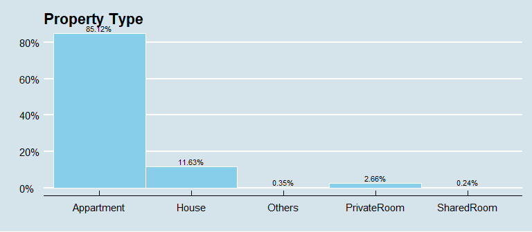
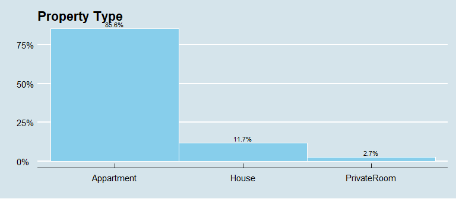
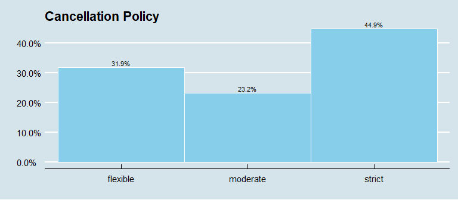

The aim of this document is to present an overview of the basis concepts of the data pre-processing. We mean by the term pre-processing the step of a Machine Learning project in which data gets transformed so that the machine can easily analyze it, especially when performing algorithms. Indeed raw data face a large number of issues which the best known are missing data, inconsistent and dupplicated values, outliers, categorical variable and feature scaling. All these points must be taken into account in order to carry out a project, and this first task is a major step in a ML project. Sophisticated algorithms will not compensate for bad data.

So without wasting time, let's take a closer look at the different steps of the data Pre Processing!

# Data formatting

Before going into the details of data cleaning, you have make sure that your data are in the right format, which means managing with these different tasks:

## Variable selection 

A lot of dataset are available online in csv formats. The following work is based on the open data from *[inside Airbnb] (http://insideairbnb.com/get-the-data.html)*. Our objective will be to set up a model allowing to forecast the price of the housing available on the platform. In this setting we will focus on the housing available in New York city. 


```r
# Import the downloaded data
files <- read.csv("https://raw.githubusercontent.com/lavergnetse/Data/master/listings.csv", sep = ",")

# Let's have a first overview of our dataset
dplyr::glimpse(files)
```

```
## Rows: 50,222
## Columns: 36
## $ id                               <int> 2060, 2595, 3831, 5099, 5121, 5178...
## $ name                             <chr> "Modern NYC", "Skylit Midtown Cast...
## $ price                            <chr> "$100.00", "$225.00", "$89.00", "$...
## $ neighbourhood_group_cleansed     <chr> "Manhattan", "Manhattan", "Brookly...
## $ neighbourhood_cleansed           <chr> "Washington Heights", "Midtown", "...
## $ latitude                         <dbl> 40.85722, 40.75362, 40.68514, 40.7...
## $ longitude                        <dbl> -73.93790, -73.98377, -73.95976, -...
## $ property_type                    <chr> "Other", "Apartment", "Guest suite...
## $ accommodates                     <int> 2, 2, 3, 2, 2, 2, 1, 2, 2, 2, 2, 1...
## $ bedrooms                         <int> 1, 0, 1, 1, 1, 1, 1, 1, 1, 1, 1, 1...
## $ beds                             <int> 2, 1, 4, 1, 1, 1, 1, 1, 1, 1, 0, 1...
## $ bed_type                         <chr> "Real Bed", "Real Bed", "Real Bed"...
## $ cleaning_fee                     <chr> "", "$95.00", "", "$125.00", "$0.0...
## $ minimum_nights                   <int> 1, 3, 1, 3, 29, 2, 2, 1, 2, 3, 4, ...
## $ availability_30                  <int> 1, 30, 29, 0, 30, 27, 0, 0, 0, 0, ...
## $ availability_60                  <int> 1, 60, 45, 0, 60, 37, 0, 5, 0, 0, ...
## $ availability_90                  <int> 1, 90, 49, 0, 90, 48, 0, 35, 0, 26...
## $ availability_365                 <int> 1, 365, 261, 0, 365, 272, 0, 307, ...
## $ host_is_superhost                <chr> "f", "f", "f", "f", "f", "f", "f",...
## $ reviews_per_month                <dbl> 0.01, 0.38, 4.66, 0.58, 0.38, 3.53...
## $ review_scores_rating             <int> 80, 94, 89, 90, 90, 84, 98, 94, 97...
## $ cancellation_policy              <chr> "flexible", "strict_14_with_grace_...
## $ require_guest_profile_picture    <chr> "f", "t", "f", "t", "f", "f", "t",...
## $ require_guest_phone_verification <chr> "f", "t", "f", "t", "f", "f", "t",...
## $ calculated_host_listings_count   <int> 1, 2, 1, 1, 1, 1, 1, 4, 1, 1, 3, 1...
## $ extra_people                     <chr> "$0.00", "$0.00", "$0.00", "$100.0...
## $ smart_location                   <chr> "New York, NY", "New York, NY", "B...
## $ number_of_reviews_ltm            <int> 0, 4, 63, 7, 1, 50, 0, 3, 32, 1, 1...
## $ minimum_nights_avg_ntm           <dbl> 1, 3, 1, 3, 29, 2, 2, 1, 2, 3, 4, ...
## $ maximum_nights_avg_ntm           <dbl> 730, 1125, 1125, 21, 730, 14, 14, ...
## $ country_code                     <chr> "US", "US", "US", "US", "US", "US"...
## $ country                          <chr> "United States", "United States", ...
## $ first_review                     <chr> "2008-09-22", "2009-11-21", "2014-...
## $ last_review                      <chr> "2008-09-22", "2019-11-04", "2020-...
## $ guests_included                  <int> 1, 1, 1, 2, 1, 1, 1, 2, 1, 2, 1, 1...
## $ host_name                        <chr> "Jenny", "Jennifer", "LisaRoxanne"...
```

The `glimpse` function allows to see a first global view of our raw data. And as we can see, our dataset contains 36 variables, with some of them which may not be relevant to our project. We thus have to do a first sort and keep only the relevant ones, that is to say all the variables whose value can have an impact on the housing price. This selection task can be realized using empirical results, literature review, etc. 
In our example, the predictors we need are those that give information about the housing (location, attributes, rating), the host attributes and the rental rules.


```r
# Select the columns we want to keep from the initial listings csv files
listings_keep <- c("id", "price", "host_is_superhost",
                   "neighbourhood_group_cleansed", "neighbourhood_cleansed",
                   "latitude","longitude", "property_type", "accommodates",
                   "bedrooms", "beds", "bed_type", "cleaning_fee",
                   "minimum_nights", "availability_365",
                   "review_scores_rating","cancellation_policy")

listings <-  files[,listings_keep]
```

## Dealing with inconsistent values

As we saw before, some values are meaningless and must be treated in order to get an operational database. First of all, we need to focus on the id of the housing. Indeed when we deal with large database, we often face duplicated values that we have to drop.  

- Eliminate all duplicates listings


```r
listings <- listings[!duplicated(listings$id),]
```

- Eliminate observations with missing id


```r
listings <- listings[complete.cases(listings$id),]
```

Then another common thing to do is to look at the class of each variables, focusing particularly on the numerical ones, and also at the summary of your data. This work will help you to have a first look on your data, and see the points that you might find surprising.   


```r
# Check the statistical summary of each variables
library(Hmisc)
Hmisc::describe(listings)
```

```
## listings 
## 
##  17  Variables      50222  Observations
## --------------------------------------------------------------------------------
## id 
##        n  missing distinct     Info     Mean      Gmd      .05      .10 
##    50222        0    50222        1 22832957 15416219  1653074  4172664 
##      .25      .50      .75      .90      .95 
## 10960561 22290355 35264495 40836556 42348062 
## 
## lowest :     2060     2595     3831     5099     5121
## highest: 43366319 43366369 43366411 43366638 43366674
## --------------------------------------------------------------------------------
## price 
##        n  missing distinct 
##    50222        0      661 
## 
## lowest : $0.00     $1,000.00 $1,002.00 $1,020.00 $1,032.00
## highest: $988.00   $99.00    $990.00   $995.00   $999.00  
## --------------------------------------------------------------------------------
## host_is_superhost 
##        n  missing distinct 
##    50211       11        2 
##                       
## Value          f     t
## Frequency  40296  9915
## Proportion 0.803 0.197
## --------------------------------------------------------------------------------
## neighbourhood_group_cleansed 
##        n  missing distinct 
##    50222        0        5 
## 
## lowest : Bronx         Brooklyn      Manhattan     Queens        Staten Island
## highest: Bronx         Brooklyn      Manhattan     Queens        Staten Island
##                                                                   
## Value              Bronx      Brooklyn     Manhattan        Queens
## Frequency           1198         20130         22372          6152
## Proportion         0.024         0.401         0.445         0.122
##                         
## Value      Staten Island
## Frequency            370
## Proportion         0.007
## --------------------------------------------------------------------------------
## neighbourhood_cleansed 
##        n  missing distinct 
##    50222        0      223 
## 
## lowest : Allerton        Arden Heights   Arrochar        Arverne         Astoria        
## highest: Windsor Terrace Woodhaven       Woodlawn        Woodrow         Woodside       
## --------------------------------------------------------------------------------
## latitude 
##        n  missing distinct     Info     Mean      Gmd      .05      .10 
##    50222        0    19230        1    40.73  0.06115    40.65    40.67 
##      .25      .50      .75      .90      .95 
##    40.69    40.72    40.76    40.81    40.83 
## 
## lowest : 40.49979 40.50868 40.52211 40.52293 40.53076
## highest: 40.91031 40.91055 40.91079 40.91169 40.91699
## --------------------------------------------------------------------------------
## longitude 
##        n  missing distinct     Info     Mean      Gmd      .05      .10 
##    50222        0    15018        1   -73.95  0.04813   -74.00   -74.00 
##      .25      .50      .75      .90      .95 
##   -73.98   -73.96   -73.93   -73.91   -73.86 
## 
## lowest : -74.24084 -74.23986 -74.21238 -74.20877 -74.20295
## highest: -73.72179 -73.72173 -73.71928 -73.71740 -73.71299
## --------------------------------------------------------------------------------
## property_type 
##        n  missing distinct 
##    50222        0       40 
## 
## lowest : Aparthotel        Apartment         Barn              Bed and breakfast Boat             
## highest: Townhouse         Train             Treehouse         Villa             Yurt             
## --------------------------------------------------------------------------------
## accommodates 
##        n  missing distinct     Info     Mean      Gmd      .05      .10 
##    50222        0       19    0.895    2.849    1.756        1        1 
##      .25      .50      .75      .90      .95 
##        2        2        4        5        6 
## 
## lowest :  1  2  3  4  5, highest: 15 16 19 20 22
##                                                                             
## Value          1     2     3     4     5     6     7     8     9    10    11
## Frequency   7696 23060  5474  7627  1989  2474   478   714    92   244    41
## Proportion 0.153 0.459 0.109 0.152 0.040 0.049 0.010 0.014 0.002 0.005 0.001
##                                                           
## Value         12    13    14    15    16    19    20    22
## Frequency    105    21    33    15   156     1     1     1
## Proportion 0.002 0.000 0.001 0.000 0.003 0.000 0.000 0.000
## --------------------------------------------------------------------------------
## bedrooms 
##        n  missing distinct     Info     Mean      Gmd      .05      .10 
##    50102      120       16    0.635    1.185   0.6412        0        1 
##      .25      .50      .75      .90      .95 
##        1        1        1        2        3 
## 
## lowest :  0  1  2  3  4, highest: 11 13 14 21 22
##                                                                             
## Value          0     1     2     3     4     5     6     7     8     9    10
## Frequency   4648 35694  6799  2184   552   141    38    18    15     4     4
## Proportion 0.093 0.712 0.136 0.044 0.011 0.003 0.001 0.000 0.000 0.000 0.000
##                                         
## Value         11    13    14    21    22
## Frequency      1     1     1     1     1
## Proportion 0.000 0.000 0.000 0.000 0.000
## --------------------------------------------------------------------------------
## beds 
##        n  missing distinct     Info     Mean      Gmd      .05      .10 
##    49696      526       24    0.748    1.545   0.9511        1        1 
##      .25      .50      .75      .90      .95 
##        1        1        2        3        4 
## 
## lowest :  0  1  2  3  4, highest: 21 22 24 26 40
## --------------------------------------------------------------------------------
## bed_type 
##        n  missing distinct 
##    50210       12        5 
## 
## lowest : Airbed        Couch         Futon         Pull-out Sofa Real Bed     
## highest: Airbed        Couch         Futon         Pull-out Sofa Real Bed     
##                                                                   
## Value             Airbed         Couch         Futon Pull-out Sofa
## Frequency            149            64           265           225
## Proportion         0.003         0.001         0.005         0.004
##                         
## Value           Real Bed
## Frequency          49507
## Proportion         0.986
## --------------------------------------------------------------------------------
## cleaning_fee 
##        n  missing distinct 
##    39465    10757      214 
## 
## lowest : $0.00     $1,000.00 $1,200.00 $10.00    $100.00  
## highest: $95.00    $96.00    $97.00    $98.00    $99.00   
## --------------------------------------------------------------------------------
## minimum_nights 
##        n  missing distinct     Info     Mean      Gmd      .05      .10 
##    50222        0      111    0.967    7.914     10.5        1        1 
##      .25      .50      .75      .90      .95 
##        1        3        5       30       30 
## 
## lowest :    1    2    3    4    5, highest:  600  999 1000 1124 1250
## --------------------------------------------------------------------------------
## availability_365 
##        n  missing distinct     Info     Mean      Gmd      .05      .10 
##    50222        0      366    0.929    121.8      150        0        0 
##      .25      .50      .75      .90      .95 
##        0       65      249      364      365 
## 
## lowest :   0   1   2   3   4, highest: 361 362 363 364 365
## --------------------------------------------------------------------------------
## review_scores_rating 
##        n  missing distinct     Info     Mean      Gmd      .05      .10 
##    38223    11999       53    0.971    93.82    7.804       80       85 
##      .25      .50      .75      .90      .95 
##       92       96      100      100      100 
## 
## lowest :  20  30  40  45  47, highest:  96  97  98  99 100
## --------------------------------------------------------------------------------
## cancellation_policy 
##        n  missing distinct 
##    50222        0        6 
## 
## lowest : flexible                    moderate                    strict                      strict_14_with_grace_period super_strict_30            
## highest: moderate                    strict                      strict_14_with_grace_period super_strict_30             super_strict_60            
## 
## flexible (16085, 0.320), moderate (11666, 0.232), strict (2, 0.000),
## strict_14_with_grace_period (22362, 0.445), super_strict_30 (16, 0.000),
## super_strict_60 (91, 0.002)
## --------------------------------------------------------------------------------
```

We can thus see that:

- *price* and *cleaning_fee* are stored as factor instead of numeric


```r
# Eliminate the $ sign on price
listings$price = as.numeric(gsub("[\\$,]", "", listings$price))

# Eliminate the $ sign on cleaning fee
listings$cleaning_fee = as.numeric(gsub("[\\$,]", "", listings$cleaning_fee))
```

- *host_is_superhost* presents 11 missing values that are not indexed as NA's  


```r
# Replace the empty cells by NA's
listings$host_is_superhost[listings$host_is_superhost==""] <- NA
```

- there are observations where *price* or *availability_365* are equal to 0


```r
# For the sake of simplicity, we delete the observations where price is null
listings <- listings %>% filter(price > 0) 

# Almost 40% of the observations (20687) with availability_365 = 0 
listings %>% count (availability_365 == 0)
```

```
##   availability_365 == 0     n
## 1                 FALSE 29509
## 2                  TRUE 20687
```

Such a high number let us think that it is not due to bad data. Conversely, one would therefore think that the listing were not available at the moment of data collection. In consequence those hosts had their listing availability set to 0 or «Not available». 

Finally we can suspect the presence of inconsistencies in our data, such as observations where the accommodate capacity is lower than the number of beds, so we check for that and remove those observations if necessary:


```r
# For the sake of simplicity, we delete the observations where price is null
listings <- listings %>% filter(accommodates >= beds) 
```

Once we have complete this first step, we can export the database in our repository. This step is not obligatory, but it allows to keep track of our data before cleaning it.


```r
# Export the listing compiled database
write.csv(listings, "/Users/.../data_compiled.csv", row.names = FALSE)
```

# Data cleaning

We import our new database: 


## Dealing with missing values

Most of the time, you will see that your database include missing data, and dealing with this issue is mandatory in all data pre processing situation. In the following, you will see some basic methods that allow to deal with this issue.

The code below allows you to see the number of NA for each variable. 


```r
# NA count 
na_count <- as.data.frame(colSums(mydata%>%is.na(.)))
na_count
```

```
##                              colSums(mydata %>% is.na(.))
## id                                                      0
## price                                                   0
## host_is_superhost                                      11
## neighbourhood_group_cleansed                            0
## neighbourhood_cleansed                                  0
## latitude                                                0
## longitude                                               0
## property_type                                           0
## accommodates                                            0
## bedrooms                                               75
## beds                                                    0
## bed_type                                                0
## cleaning_fee                                        10375
## minimum_nights                                          0
## availability_365                                        0
## review_scores_rating                                11480
## cancellation_policy                                     0
```

- **Bedrooms**


Given the distribution, we could replace the 112 missing values of bedrooms (the number of bedrooms) by the median grouped by property type, number of accommodates and bed types.

We would use the median because we want an integer and not a float (numbers with commas). Furthermore, the median works great against skewed distribution and outliers.


```r
mydata <- mydata %>%
  group_by(
    property_type,
    accommodates) %>%
  mutate(bedrooms=ifelse(is.na(bedrooms),
                         median(bedrooms,na.rm = T),bedrooms)) %>%
  ungroup()
```

- **Cleaning fee**

A cleaning fee is a one-time fee charged by hosts to cover the cost of cleaning their rental when guests depart. Not all hosts charge this fee. Some incorporate it into their nightly rate. Therefore it is safe to assume that when there is no value for this
variable it simply means that the host didn't charge


```r
mydata[is.na(mydata$cleaning_fee), "cleaning_fee"] <- 0
```

- **Host is superhost**

There is only 11 missing values out of more than 500000.
Therefore we will just replace them by the most common value (f)


```r
mydata[is.na(mydata$host_is_superhost),"host_is_superhost"] <- "f"
```

- **Review scores rating**


Given that the distribution is skewed on the right, we will use the median to approximate the missing values grouped by neighbors, property types, type of beds and if the host is a superhost.


```r
mydata <- mydata %>%
  group_by(neighbourhood_cleansed,
           bed_type,
           property_type,
           host_is_superhost) %>%
  mutate(review_scores_rating=ifelse(is.na(review_scores_rating), 
                                     median(review_scores_rating,na.rm=T),
                                     review_scores_rating)) %>%
  ungroup()
```


There is still 216 missing values so we could just replace them with the overall score median 


```r
mydata[is.na(mydata$review_scores_rating), "review_scores_rating"] <-
  median(mydata$review_scores_rating, na.rm = T)
```

We do a final check:


```r
sum(is.na(mydata))
```

```
## [1] 0
```

As you can see, we are trying to avoid simply eliminating rows with missing data. Indeed with large number of observations and small proportions of missing data, remove them will not have a large impact on the results. However doing so with a higher proportion of NA's may removing some crucial information. That's why you should prefer the alternatives showed here : mean or median imputation using the `group_by` function. With more complex data, others imputation methods such as `Knn` or `Missforest` can be used.

## Dealing with categorical variables 

Here are the tree variables that we want to reorganize by creating new subgroups:


```r
# Property type
levels(mydata$property_type)
```

```
##  [1] "Aparthotel"             "Apartment"              "Barn"                  
##  [4] "Bed and breakfast"      "Boat"                   "Boutique hotel"        
##  [7] "Bungalow"               "Bus"                    "Cabin"                 
## [10] "Camper/RV"              "Casa particular (Cuba)" "Castle"                
## [13] "Cave"                   "Condominium"            "Cottage"               
## [16] "Dome house"             "Dorm"                   "Earth house"           
## [19] "Farm stay"              "Guest suite"            "Guesthouse"            
## [22] "Hostel"                 "Hotel"                  "House"                 
## [25] "Houseboat"              "In-law"                 "Island"                
## [28] "Lighthouse"             "Loft"                   "Other"                 
## [31] "Resort"                 "Serviced apartment"     "Tent"                  
## [34] "Timeshare"              "Tiny house"             "Townhouse"             
## [37] "Train"                  "Treehouse"              "Villa"                 
## [40] "Yurt"
```

```r
# Cancellation policy

ggplot(mydata, aes (x = cancellation_policy)) +
    geom_bar(width = 1, colour = "white", fill="skyblue", show.legend = F,
             aes(y = ((..count..)/sum(..count..)))) +
    geom_text(aes(y = ((..count..)/sum(..count..)),
                  label = scales::percent((..count..)/sum(..count..))),
              stat = "count", size=3, vjust = -.3) +
    scale_y_continuous(labels = scales::percent) +
    labs(x = "", y = "") + 
    ggtitle("Cancellation Policy") +
    theme_economist()
```


```r
#Bed_type

ggplot(mydata, aes (x = bed_type)) +
    geom_bar(width = 1, colour = "white", fill="skyblue", show.legend = F,
             aes(y = ((..count..)/sum(..count..)))) +
    geom_text(aes(y = ((..count..)/sum(..count..)),
                  label = scales::percent((..count..)/sum(..count..))),
              stat = "count", size=3, vjust = -.3) +
    scale_y_continuous(labels = scales::percent) +
    labs(x = "", y = "") + 
    ggtitle("Type of bed") +
   theme_economist()
```


\
- Subgroup for **Property type**

We groups all 40 subgroups of housing types into 5 big groups:


```r
Appartment <- c("Aparthotel","Serviced apartment", "Loft",
                "Condominium", "Apartment")

House <- c("Barn", "Dome house", "Lighthouse", "Houseboat",
           "Treehouse", "Earth house", "Cottage", "Tiny house",
           "Townhouse", "House", "Cabin","Villa")

Shared_room <- c("Dorm", "Hostel", "Guesthouse", "Timeshare")

Private_room <- c("Farm stay", "Bed and breakfast", "Resort", "Hotel",
                  "Boutique hotel", "Guest suite", "In-law")

Other <- c("Bungalow", "Train", "Bus", "Boat", "Other", "Cave", "Island",
           "Camper/RV", "Yurt", "Castle", "Tent", "Casa particular (Cuba)")

mydata$property_type <- as.character(mydata$property_type)

mydata <-
  mutate(mydata,
         property_type = ifelse(property_type %in% Appartment,
                                "Appartment", property_type),
         property_type = ifelse(property_type %in% House,
                                "House", property_type),
         property_type = ifelse(property_type %in% Shared_room,
                                "SharedRoom", property_type),
         property_type = ifelse(property_type %in% Private_room,
                                "PrivateRoom", property_type),
         property_type = ifelse(property_type %in% Other,
                                "Others", property_type))
```

Now we can plot our new variable:


```r
# Property type
ggplot(mydata, aes (x = property_type)) +
    geom_bar(width = 1, colour = "white", fill="skyblue", show.legend = F,
             aes(y = ((..count..)/sum(..count..)))) +
    geom_text(aes(y = ((..count..)/sum(..count..)),
                  label = scales::percent((..count..)/sum(..count..))),
              stat = "count", size=3, vjust = -.3) +
    scale_y_continuous(labels = scales::percent) +
    labs(x = "", y = "") + 
    ggtitle("Property Type") +
  theme_economist()
```



Then we remove the observation associated to the property type "Other" & "SharedRoom" 
since it brings together a set of marginal housing category


```r
mydata <- mydata[!mydata$property_type=="Others",]
mydata <- mydata[!mydata$property_type=="SharedRoom",]
```



\
- Subgroup for **Cancellation policy**

We groups all 4 subgroups of strict types into only group


```r
mydata$cancellation_policy <- as.character(mydata$cancellation_policy)

mydata <- mutate(mydata, 
               cancellation_policy = 
                 ifelse(cancellation_policy=="strict_14_with_grace_period",
                        "strict", cancellation_policy),
               cancellation_policy =
                 ifelse(cancellation_policy=="super_strict_30", 
                        "strict", cancellation_policy),
               cancellation_policy =
                 ifelse(cancellation_policy=="super_strict_60", 
                        "strict", cancellation_policy))
```



\
- Subgroup for **Bed Types**

Since only a handful of 699 observations out of more than 50000 housing
have their bed type value which is different from "Real Bed", we can either spread these
marginal observations into a subgroup "others" or remove this variable (which is finally
meaningless).
In this example we decided to remove bed_type


```r
mydata <- mydata[,-which(names(mydata) == "bed_type")]
```

\
- Subgroup for **Host status**

For the reading we can change the "t" to "True" and "f" to "False":


```r
mydata <- mutate(mydata, 
               host_is_superhost = ifelse(host_is_superhost=="t", 
                                          "True", "False"))
```

We finally export our cleaned database for the next steps of the project.


```r
write.csv(mydata, "/Users/lemauffjulien/Desktop/data/clean_data.csv", row.names = FALSE) 
```


